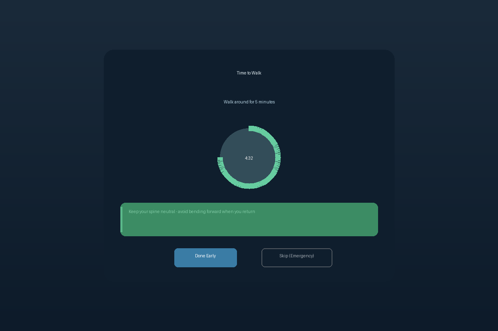

# SpineGuard

A desktop application for Linux that enforces healthy breaks during computer work, specifically designed to aid recovery from lumbar disc injuries (L5-S1). Built with Python and GTK4.



## Overview

SpineGuard uses a modified Pomodoro technique tailored for spinal health. Every 25 minutes, a full-screen overlay appears prompting you to take a break. Breaks alternate between walking (5 minutes) and lying down (10 minutes) to promote disc decompression and prevent prolonged sitting.

The overlay cannot be minimized or hidden, ensuring you actually take the break your spine needs.

## Screenshots

### Walk Break


### Lie Down Break


### Desktop Notifications


## Features

### Core Timer System
- 25-minute work sessions with full-screen break overlays
- Alternating break types: Walk (5 min) and Lie Down (10 min)
- Circular countdown timer with visual progress indicator
- Sound notifications when breaks start and end

### Additional Reminders
- Water reminders every 60 minutes
- Supplement reminders at 8:00 AM and 8:00 PM
- All reminders include relevant health tips

### Health Tips
Each break displays a randomly selected tip relevant to the activity:
- Posture guidance for walking breaks
- Decompression positions for lying down (including the 90-90 position)
- McKenzie method cues
- General L5-S1 recovery advice

### System Integration
- System tray icon with timer countdown
- Pause, resume, skip, and manual break controls
- Automatic startup on login
- State persistence across restarts

## Installation

### Prerequisites

Install the required system packages:

```bash
sudo apt install python3-gi gir1.2-gtk-4.0 gir1.2-gsound-1.0
```

For system tray support (optional):

```bash
sudo apt install gir1.2-appindicator3-0.1
```

### Install SpineGuard

```bash
git clone https://github.com/judeam/spineguard.git
cd spineguard
./install.sh
```

The installer will:
- Verify dependencies
- Install the application to `~/.local/share/spineguard/`
- Create a launcher at `~/.local/bin/spineguard`
- Set up automatic startup
- Install the application icon

## Usage

### Starting the Application

SpineGuard starts automatically on login. To start manually:

```bash
spineguard
```

### System Tray Controls

Right-click the tray icon to access:

| Action | Description |
|--------|-------------|
| Pause/Resume | Pause or resume the timer |
| Skip Next Break | Skip the upcoming break and reset timer |
| Take Break Now | Trigger a break immediately |
| Quit | Exit the application |

### Break Overlay Controls

| Button | Description |
|--------|-------------|
| Done Early | Complete the break and start next work session |
| Skip (Emergency) | Skip the break entirely (use sparingly) |

## Configuration

### Timer Settings

Edit `~/.local/share/spineguard/spineguard/timers.py` to customize:

```python
POMODORO_MINUTES = 25        # Work session length
WALK_BREAK_MINUTES = 5       # Walking break duration
LIE_DOWN_BREAK_MINUTES = 10  # Lying down break duration
WATER_INTERVAL_MINUTES = 60  # Water reminder interval
```

### Supplement Times

```python
SUPPLEMENT_MORNING = dt_time(8, 0)   # 8:00 AM
SUPPLEMENT_EVENING = dt_time(20, 0)  # 8:00 PM
```

### State File

Break alternation state is stored in:
```
~/.local/share/spineguard/state.json
```

## Uninstallation

```bash
./uninstall.sh
```

This removes all installed files and the autostart entry.

## Project Structure

```
spineguard/
├── spineguard/
│   ├── app.py           # Main GTK4 application
│   ├── overlay.py       # Full-screen break window
│   ├── timers.py        # Timer management
│   ├── tray.py          # System tray integration
│   ├── notifications.py # Desktop notifications
│   ├── sounds.py        # Audio feedback
│   ├── tips.py          # Health tips database
│   └── style.css        # GTK4 styling
├── data/
│   └── spineguard.desktop
├── assets/
│   └── *.png            # Screenshots
├── install.sh
├── uninstall.sh
└── README.md
```

## Technical Details

- **GUI Framework**: GTK4 with custom CSS styling
- **System Tray**: AppIndicator3 (runs in separate process to avoid GTK3/4 conflicts)
- **Notifications**: GIO Notifications
- **Sound**: GSound with canberra-gtk fallback
- **Timer Backend**: GLib timeout functions

## Why SpineGuard?

Disc injuries like L5-S1 extrusions require consistent movement and position changes throughout the day. Standard Pomodoro timers don't enforce breaks strongly enough, and it's easy to dismiss a small notification when focused on work.

SpineGuard's full-screen overlay makes ignoring breaks impossible, while the alternating walk/lie-down pattern ensures both movement and decompression time for the spine.

## License

MIT License
