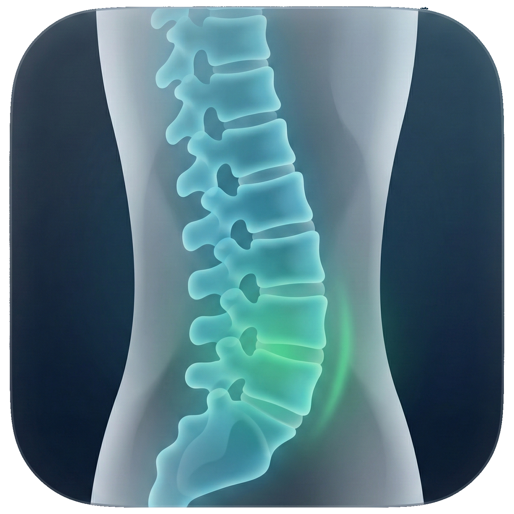
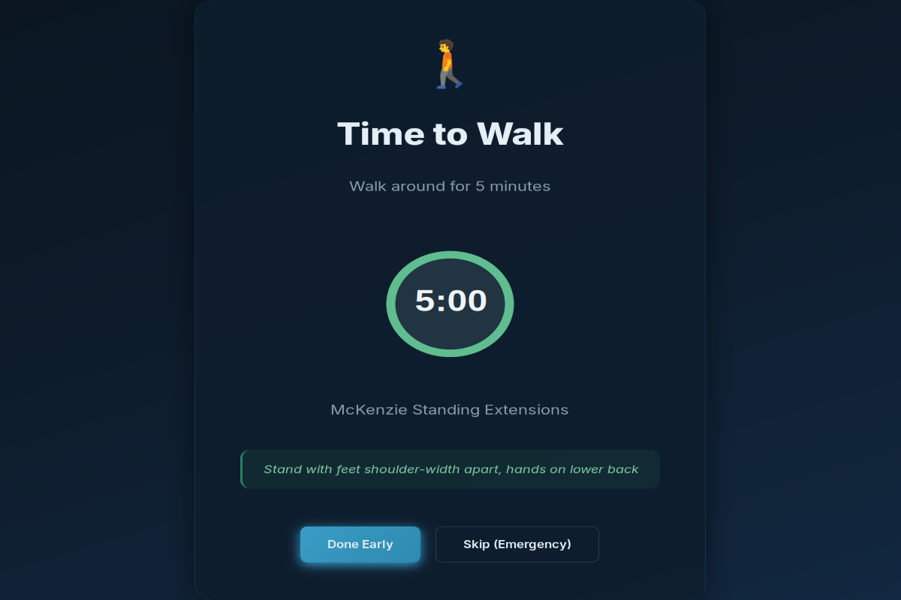
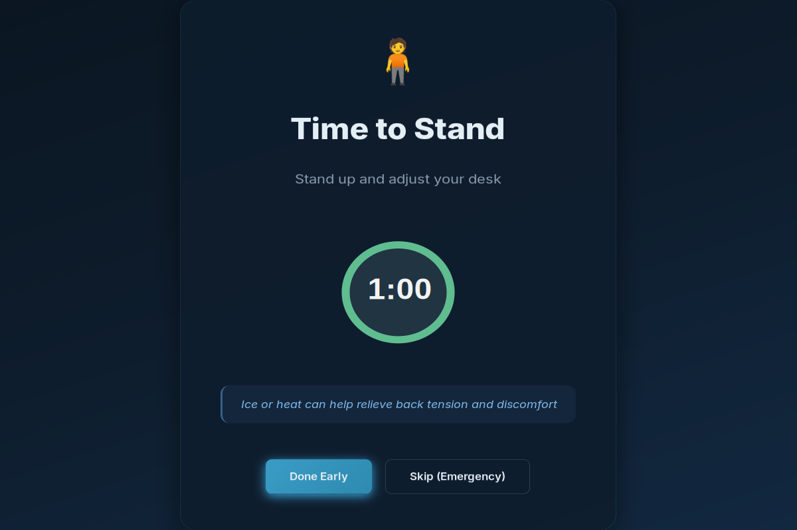
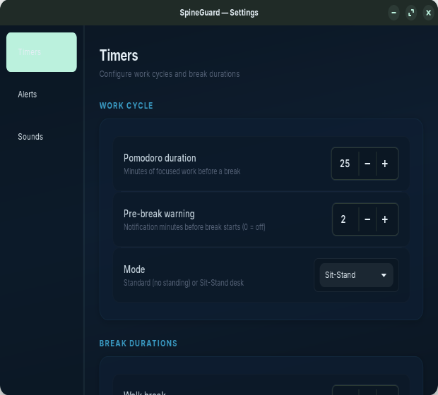
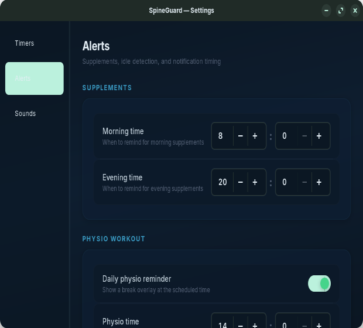
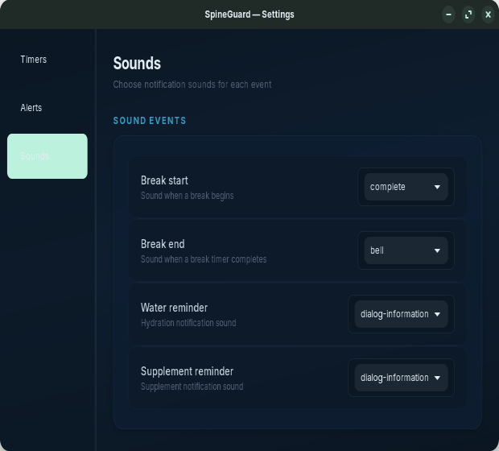

<p align="center">
  
</p>

<h1 align="center">SpineGuard</h1>

<p align="center">
  <strong>Enforced break reminders for back health on Linux</strong>
</p>

<p align="center">
  <a href="LICENSE"></a>
  
  
  <a href="https://github.com/judeam/spineguard/releases/tag/v1.0.0"></a>
</p>

<p align="center">
  
</p>

SpineGuard uses a modified Pomodoro technique designed around back health. Every 25 minutes, a full-screen overlay appears prompting you to take a break. Breaks alternate between walking (5 minutes) and lying down (10 minutes) to encourage movement, relieve pressure, and counteract prolonged sitting. The overlay cannot be minimized or hidden, ensuring you actually take the break your back needs.

---

## Table of Contents

- [Quick Start](#quick-start)
- [Screenshots](#screenshots)
- [Features](#features)
- [Installation](#installation)
- [Usage](#usage)
- [Configuration](#configuration)
- [Compatibility](#compatibility)
- [Troubleshooting](#troubleshooting)
- [Contributing](#contributing)
- [Acknowledgments](#acknowledgments)
- [License](#license)

## Quick Start

```bash
# Install dependencies (Debian/Ubuntu)
sudo apt install python3-gi gir1.2-gtk-4.0 gir1.2-gsound-1.0

# Clone, install, and run
git clone https://github.com/judeam/spineguard.git
cd spineguard
./install.sh
spineguard
```

## Screenshots

### Break Overlays

| Walk Break | Lie Down Break |
|:---:|:---:|
|  |  |

### Guided Exercise Routines

Breaks include step-by-step routines (McKenzie extensions, posture resets, spinal decompression) that advance automatically with the timer.



### Physio Workout & Position Switch

| Physio Break | Position Switch |
|:---:|:---:|
|  |  |

### Settings

| Timers | Alerts | Sounds |
|:---:|:---:|:---:|
|  |  |  |

## Features

### Break System
- **Pomodoro work sessions** (configurable, default 25 min) with full-screen break overlays
- **Alternating break types**: Walk (5 min) and Lie Down (10 min)
- **Guided exercise routines** during breaks (McKenzie extensions, posture resets, spinal decompression)
- **Circular countdown timer** with visual progress indicator
- **Pre-break warning** notifications (configurable, default 2 min before)
- **Done Early** and **Skip (Emergency)** controls on every break

### Physio Workout
- **Daily scheduled physio break** at a configurable time (default 2:00 PM)
- **Count-up timer** with 10-second lockout on the Done button to prevent reflexive dismissal

### Sit-Stand Desk Mode
- **Position switch reminders** at configurable intervals (default 30 min)
- Tracks current sit/stand position across restarts

### Additional Reminders
- **Water reminders** every 60 minutes (configurable) via desktop notifications
- **Supplement reminders** at morning and evening times (configurable)
- All reminders include snooze actions and contextual health tips

### Smart Pausing
- **Idle detection**: auto-pauses timers when away from keyboard (configurable threshold)
- **Screen lock detection**: auto-pauses when the screen locks or system suspends
- **Manual pause/resume** from the system tray

### Settings & System Integration
- Three-page settings dialog for timers, alerts, and sounds
- **System tray icon** with live timer countdown and full control menu
- **Automatic startup** on login
- **State persistence** across restarts (break alternation, sit/stand position)
- **Multi-monitor support**: blocking overlays on all screens
- **Break statistics** tracking (completed, skipped, done early)

## Installation

### Debian/Ubuntu

Install dependencies and run the installer:

```bash
sudo apt install python3-gi gir1.2-gtk-4.0 gir1.2-gsound-1.0
```

For system tray support (optional):

```bash
sudo apt install gir1.2-appindicator3-0.1
```

Then install SpineGuard:

```bash
git clone https://github.com/judeam/spineguard.git
cd spineguard
./install.sh
```

This installs to `~/.local/share/spineguard/`, creates a launcher at `~/.local/bin/spineguard`, and sets up automatic startup.

### Arch Linux (AUR)

Install dependencies:

```bash
sudo pacman -S python-gobject gtk4
```

Optional dependencies:

```bash
sudo pacman -S gsound libappindicator-gtk3
```

Build and install using the PKGBUILD:

```bash
git clone https://github.com/judeam/spineguard.git
cd spineguard
makepkg -si
```

### From Source (pip)

Requires system GTK4 and PyGObject packages to be installed first (see Debian or Arch sections above for those).

```bash
git clone https://github.com/judeam/spineguard.git
cd spineguard
pip install .
```

### Development

Run directly from source with no install step:

```bash
git clone https://github.com/judeam/spineguard.git
cd spineguard
python3 -m spineguard.app
```

## Usage

### Starting the Application

SpineGuard starts automatically on login. To start manually:

```bash
spineguard
```

### System Tray Controls

Right-click the tray icon to access:

| Action | Description |
|--------|-------------|
| Pause/Resume | Pause or resume all timers |
| Skip Next Break | Skip the upcoming break and reset timer |
| Take Break Now | Trigger a break immediately |
| Settings | Open the settings dialog |
| Statistics | View break completion stats |
| Quit | Exit the application |

### Break Overlay Controls

| Button | Description |
|--------|-------------|
| Done Early | Complete the break and start next work session |
| Skip (Emergency) | Skip the break entirely (use sparingly) |
| Done | Physio break only — enabled after 10 seconds |

## Configuration

All settings are managed through the built-in Settings dialog (System Tray > Settings) and persisted to:

```
~/.config/spineguard/config.json
```

| Setting | Default | Description |
|---------|---------|-------------|
| Pomodoro duration | 25 min | Work session length |
| Walk break | 5 min | Walking break duration |
| Lie-down break | 10 min | Decompression break duration |
| Pre-break warning | 2 min | Notification before break (0 = off) |
| Mode | Standard | Standard or Sit-Stand desk |
| Water reminder | 60 min | Interval between hydration reminders |
| Position switch | 30 min | Interval between sit/stand transitions |
| Morning supplements | 8:00 | Morning supplement reminder time |
| Evening supplements | 20:00 | Evening supplement reminder time |
| Physio workout | 14:00 | Daily physio break time |
| Idle threshold | 2 min | Minutes before auto-pause on idle |

Break alternation and position state is stored in `~/.local/share/spineguard/state.json`.

## Compatibility

### Desktop Environments

Tested on GNOME, KDE Plasma, and XFCE. Should work on any GTK4-compatible desktop environment.

### X11 vs Wayland

- **Wayland**: Fully functional. Full-screen overlay behavior may vary slightly depending on compositor.
- **X11**: Fully functional. Global keyboard shortcuts (via Keybinder) are X11-only.

### System Tray

The tray icon requires AppIndicator support. Most desktops support this natively or via an extension (e.g., GNOME's AppIndicator extension).

### Python

Requires **Python 3.10** or later.

## Troubleshooting

**Tray icon not showing**
Install the AppIndicator dependency (`gir1.2-appindicator3-0.1` on Debian/Ubuntu, `libappindicator-gtk3` on Arch). On GNOME, install the [AppIndicator extension](https://extensions.gnome.org/extension/615/appindicator-support/).

**No sound on break start/end**
Install GSound (`gir1.2-gsound-1.0` on Debian/Ubuntu, `gsound` on Arch). SpineGuard also falls back to `canberra-gtk-play` if available.

**Overlay not covering full screen on Wayland**
Some compositors handle full-screen windows differently. Try running SpineGuard on X11 if this is a persistent issue. On GNOME Wayland, the overlay should work correctly.

**Checking logs for errors**
Run SpineGuard from the terminal to see error output:

```bash
python3 -m spineguard.app
```

## Uninstallation

If installed via `install.sh`:

```bash
./uninstall.sh
```

If installed via pip:

```bash
pip uninstall spineguard
```

## Contributing

Contributions are welcome! See [CONTRIBUTING.md](CONTRIBUTING.md) for development setup, architecture notes, and guidelines.

## Acknowledgments

- Break routines inspired by the [McKenzie Method](https://en.wikipedia.org/wiki/McKenzie_method) of physical therapy
- Built with [GTK4](https://gtk.org/) and [PyGObject](https://pygobject.gnome.org/)
- System tray powered by [AppIndicator3](https://lazka.github.io/pgi-docs/AppIndicator3-0.1/)

## Changelog

See [CHANGELOG.md](CHANGELOG.md) for release history.

## Why SpineGuard?

Prolonged sitting is one of the worst things you can do for your back. Standard Pomodoro timers don't enforce breaks strongly enough — it's easy to dismiss a small notification when focused on work. SpineGuard's full-screen overlay makes ignoring breaks impossible, while alternating walk/lie-down breaks ensure both movement and rest. Guided exercise routines take the guesswork out of what to do during breaks.

## License

[MIT License](LICENSE) — Copyright (c) 2025 Jude A M
